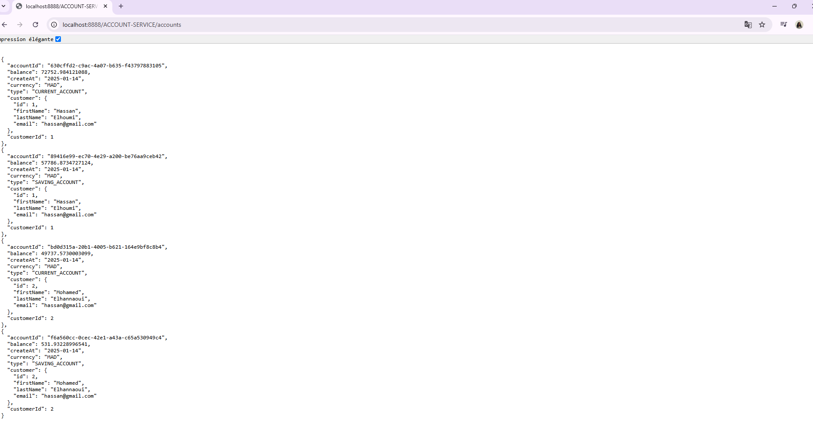

<h4>Application full stack qui permet de déployer une architecture microservices avec Docker en utilisant Docker Compose</h4>

Le service de  Account fonctionne correctement ce qui implique que la passerelle customer fonctionne également bien car elle est associée et que les autres services (configuration et découverte) sont eux aussi opérationnels

